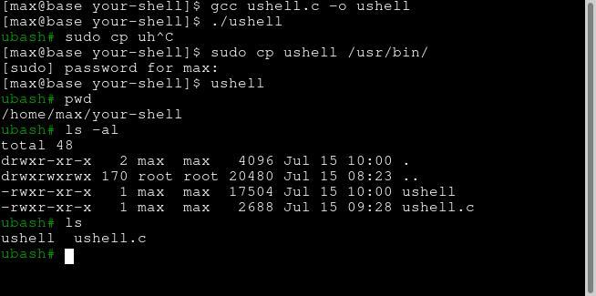

# ushell

**ushell** is a simple implementation of a shell in C. It demonstrates the basics of how a shell works. It's how you can write a `shell` using **100 line** of code!


— Richard Feynman: What I cannot create, I do not understand. 



### Compile

```
$ gcc ushell.c -o ushell
$ ./ushell
```

### Copy ubash into your main binary directory system

```
$ sudo cp ushell /usr/bin/
$ ushell
```

---------

# Max Base

My nickname is Max, Programming language developer, Full-stack programmer. I love computer scientists, researchers, and compilers. ([Max Base](https://maxbase.org/))

## Asrez Team

A team includes some programmer, developer, designer, researcher(s) especially Max Base.

[Asrez Team](https://www.asrez.com/)

